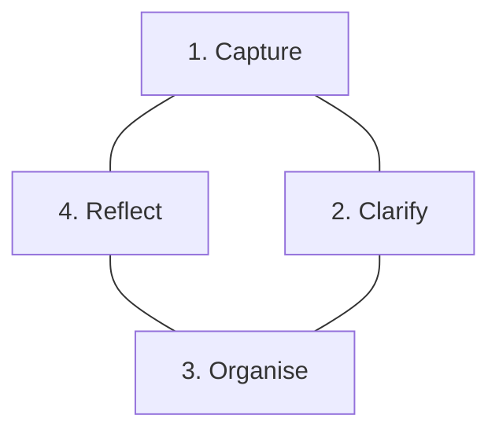
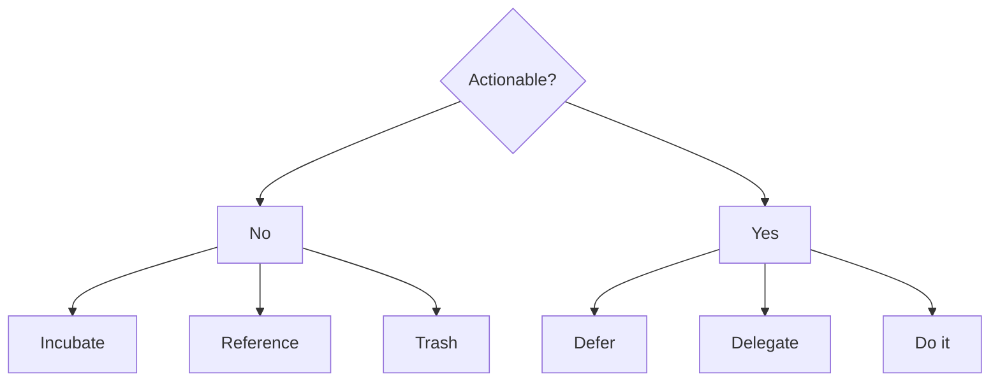

_or at least writing it down_

# Preamble

Over the last month I've invested my time in improving various often-neglected
skills.
I was considering two different avenues: 
1. How my relationships impact my day-to-day effectiveness.
2. Balancing tasks has become more difficult with increased responsibility.

The next couple of posts are a summary of interesting resources I've adapted 
to help cope with the growing complexities of adulthood.

Starting off with an organisation method: Getting Things Done.
It's well known and simple to understand.
I've adapted it for my needs and it has served me well over the last couple of
weeks. Jury's still out on making life easier at this stage, but it's looking 
promising for now.

# The Method

[Getting Things Done](https://gettingthingsdone.com/what-is-gtd/) (GTD) boils 
down to 5 steps (but really 4).

## Capture
The essence of Capturing focuses on clearing up your mind from all the tasks
that require balancing.
This works if everything is written down, and if this is done frequently.
Everything includes almost all random, tiny, suprising tasks that need handling
on a day-to-day basis.
The philosophy asks for a notebook carried at all times, to jot down the idea
on the spot.
It insists on pen/paper instead of any digital notes if possible.

I've found that this works better on a week-to-week basis, which I'll comment 
on after the next steps are layed out.

## Clarify

The Clarify step is small but important.
It sifts between tasks that can be done under a known time limit Vs. tasks that
have vague completion times for one reason or another.
It asks the question:

_"Is this task actionable?"_

It splits the responses to the question into further subcategories.

Let's explain the terms.
First the "No" side.

* _Incubate:_ A task that would be nice to be completed but you're 
missing information that you are waiting on, or are dependent on other people 
to continue. Can be postponed for a long time, and even missed.

* _Reference:_ This information won't help complete a task, it's just useful
to return to in case you might need it later.

* _Trash:_ Information you've decided you don't need.
You've captured it, crossed it out, safely disposed of it.

Now for the "Yes" side.

* _Delegate:_ A task that needs to be done but someone else is better suited
to do it. Delegate it, make a new task to follow up on it.

* _Defer:_ A task that **needs** to be completed but you're 
missing information that you are waiting on, or are dependent on other people 
to continue. 

* _Do it_: A task that needs to be completed by you, in a timely manner.

