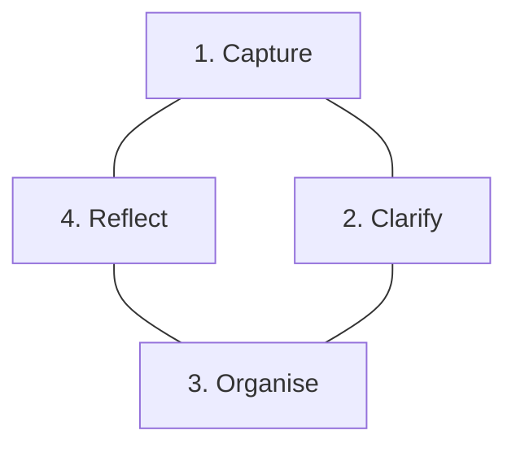
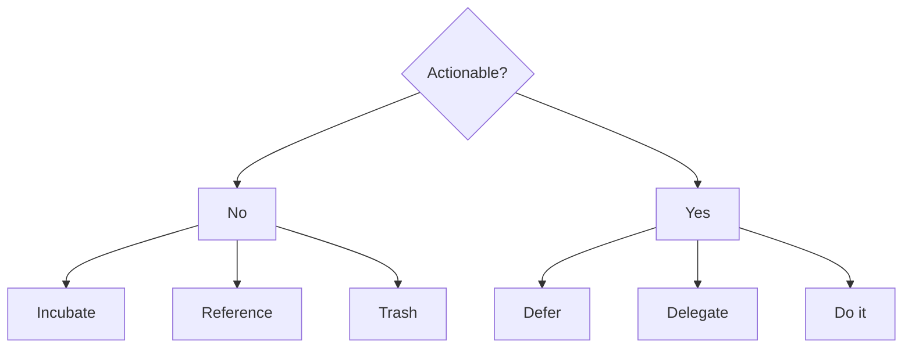

_or at least writing them down._

# Preamble

Over the last month I've invested my time in improving various often-neglected
skills.
I was considering two different avenues: 
1. How my relationships impact my day-to-day effectiveness.
2. Balancing tasks has become more difficult with increased responsibility.

The next couple of posts are a summary of interesting resources I've adapted 
to help cope with the growing complexities of adulthood.

Starting off with an organisation method: Getting Things Done.
It's well known and simple to understand.
I've adapted it for my needs and it has served me well over the last couple of
weeks. The jury's still out on making life easier at this stage, but it's looking 
promising for now.

# The Method

[Getting Things Done](https://gettingthingsdone.com/what-is-gtd/) (GTD) claims
tp have 5 steps, but really boils down to 4.

## Capture
The essence of Capturing focuses on clearing up your mind from all the tasks
that require balancing.
This works if everything is written down, and if this is done frequently.
Everything includes almost all random, tiny, suprising tasks that need handling
on a day-to-day basis.
The philosophy asks for a notebook carried at all times, to jot down the idea
on the spot.
It insists on pen/paper instead of any digital notes if possible.

## Clarify

The Clarify step is small but important.
It sifts between tasks that can be done under a known time limit Vs. tasks that
have vague completion times for one reason or another.
It asks the questions:

|1) _"Is this task actionable?"_| 2) _"What's the next action?"_|

It splits the responses to the questions into further subcategories.

I've simplified the diagram and merged some categories to summarise the information
I found important.
Let's explain the terms.

First the "No" side.

* _Incubate:_ A task that would be nice to be completed but you're 
missing information that you are waiting on, or are dependent on other people 
to continue. Can be postponed for a long time, and even missed.

* _Reference:_ This information won't help complete a task, it's just useful
to return to in case you might need it later.

* _Trash:_ Information you've decided you don't need.
You've captured it, crossed it out, safely disposed of it.

Now for the "Yes" side.

> If it can be accomplished in less than 2 minutes, stop writing it down and do it on the spot.
{: .prompt-tip }

* _Delegate:_ A task that needs to be done but someone else is better suited
to do it. Delegate it, make a new task to follow up on it.

* _Defer:_ A task that **needs** to be completed but you're 
missing information that you are waiting on, or are dependent on other people 
to continue. 

* _Do it_: A task that needs to be completed by you, in a timely manner.

## Organise

In the Organise step the idea is to sort through all the actionable tasks and 
put them in lists, or tag them to processes.
This gives an overview of what needs to be done at a project level over
various projects, as necessary.

Part of organisation includes updating the calendar with any appointments 
that are required to complete the actions.

A reminder section then captures all delegated tasks that require following up.

## Reflect

Reflection emphasises that GTD works only if it's done repeatedly and systematically.
Regularly reviewing the lists ensures tasks get completed and information is 
not lost over time.

The philosophy asks that you:
1. Review of the calendar multiple times a day
2. Check Actionable lists at least once a day
3. Do a weekly review of the whole process

# Adopting the system

After a couple of weeks testing the system I've modified it to suit my needs 
better. 
It's useful to have the abridged version written up, but I am implementing a 
compacted version of GTD which I've found to speed up the process.
This helps me as it's easy to get lost in following a process rather than
gaining value from it.
So if the process is as short as possible, it will not distract from its main 
goal (to get things done).

## The essentials

This compact version expects GTD knowleadge to execute as it bundles up 
information.
It boils down the process to what I've determined to be the two most useful 
Diagram Blocks: Incubate, and Actionable.
Capturing happens under these two columns over the day/week.
A date helps locate which GTD is currently in focus, expecting one to last a
week.
A new GTD can be made if tasks changed quickly or the old one needs refactoring.

Anything under <ins>Incubate</ins> includes all the tasks that would be nice 
to complete, but there's no time frame, and it's okay to prolong/extend and 
even miss.
It also includes all references.
I don't bother noting down trash, and anything crossed out I count as trash
visually, so it doesn't need to be moved/rewritten, even if it's in the
Actionable column.

Anything under <ins>Actionable</ins> is a task that needs Defering, Delegation
or to be completed.
Attempts at writing tasks down should try and maintain the same topic as much
as possible.
After all, when focusing on a project, it's easy to think of all the tasks.
It's much harder to jump around various tasks and write them all down.
This can fail as things come up, and as the section grows over the day, but
it's good enough.

Clarify and Organise happen in one step under these two columns. 
To assist organisation, space is left for tags/numbers next to the columns.
I usually leave space underneath the page for these columns to expand on what
the tags mean if necessary.

Numbers can be particularly useful to denote priority as well, working 
double-duty.

## An example

